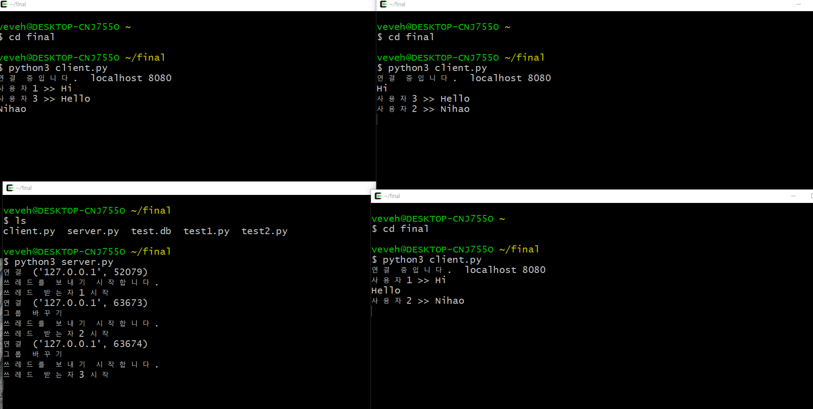

#201744065 이항주
# TCP-IP-FINAL 프로그램 개발 보고서
## 개요, 목적, 설계 및 기능, 차이점등, 실행화면 이미지
- 개요
*멀티 쓰레드를 이용한 다중 접속 채팅프로그램입니다. 이는 데이터베이스를 이용하여 참여하는 사용자 1~ n의 이름을 저장하여 로그를 남기는 채팅 프로그램을 만드려했습니다.*
- 목적
*개요와 마찬가지인 채팅을 하기 위한 프로그램입니다 .*
- 설계 및 기능
*chat_server.c 와 chat_client.c 두 파일로 구성되어있고 이름에서도 알 수 있지만 
server.c는 서버의 역할을 하고 client.c 를 통해 접속하는 방식입니다. 서버는 클라이언트의 모든 메시지를 받아 각 클라이언트에게 동일한 메시지를 전달해주어야 하며 클라이언트는 언제든 채팅서버에 접속하여 메시지를 타 클라이언트와 소통할 수 있어야합니다.*
- 차이점
*원래는 sqllite를 사용하고 그래픽 인터페이스를 활용하여 들어가기 버튼을 누르면 채팅이 실행 돼 로그인 되고 아이디가 저장되는 형식을 만드려고 했었습니다. 하지만 너무나 많은 오류로 인해 데이터 베이스를 만드는 것까지 밖에 못했으며 인터페이스는 구현하지 못하였습니다.*
- 실행화면 이미지
</img>
